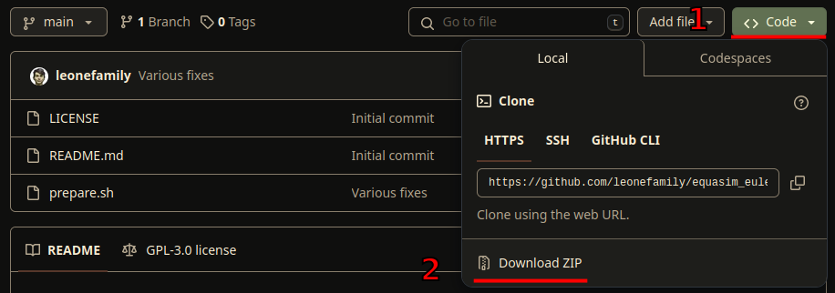
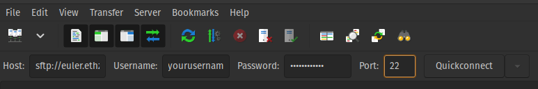
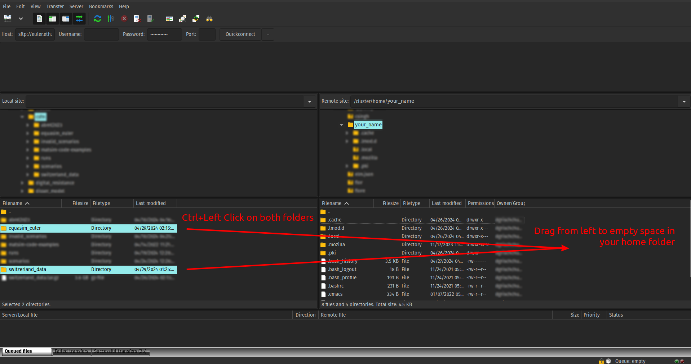

# eqasim_euler

A set of scripts to make your Euler environment setup faster

## Prerequisites
0. Data for synthesis must be already present on your system and be named `switzerland_data`
1. Download this repository:\
\
Unpack archive contents into a folder named `eqasim_euler`
_(so that all the files that you see on this page are in the folder, not a single folder with repository and branch name)_
2. Download and install **FileZilla** (available for Windows, macOS, Linux)\
This program is used to transfer files and edit directories
3. In **FileZilla** Connect to **Euler** cluster using your credentials
   - _Host_: sftp://euler.ethz.ch
   - _Username_: as in your ETH email
   - _Password_: as in your ETH email
   - _Port_: 22 should work
   - Then hit _Quickconnect_\
   
   _Note: you must have already logged in through SSH/PuTTY at least once and accepted Euler's terms and conditions_
4. Upload folder with synthesis data to your home folder on Euler cluster
   - On Euler your home folder is at `/cluster/home/your_username`, where `your_username` is the user name you used to log in to Euler
   - Click at this folder on the right, its default contents will appear in the bottom 
   - On the left side (on your current machine) locate both folder with synthesis data and scripts, and drag those folders to empty space on the right
   
   - Wait until file transfer finishes
5. Once required files are on the Euler cluster, log in to Euler through SSH/PuTTY using Terminal/Command line:
   - To quickly set up requirements run `./eqasim_euler/prepare.sh`\
   _Be aware, that shortcuts for copying and pasting in Linux Terminals are `Ctrl+Shift+C` and `Ctrl+Shift+V`. Hitting `Ctrl+C` while centered in the Terminal will interrupt any program that is currently running!_
   - Python virtual environment will be in `venv` folder in your home directory
   - Eqasim repository will be set up in `ch/ch_zh_synpp` directory